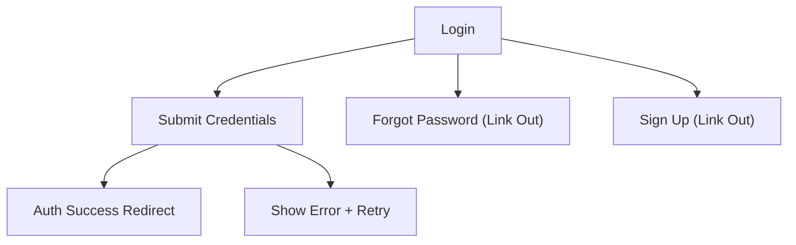

## 1. Product Overview

A responsive login page that matches the provided UI and lets users sign in quickly and safely.
Primary goal: collect credentials, validate input, and initiate an authentication request with clear feedback.

## 2. Core Features

### 2.1 Feature Module

Our authentication requirements consist of the following main pages:

1. **Login**: brand/illustration panel, login form, password visibility toggle, validation + error handling, primary sign-in CTA, secondary navigation links.

### 2.3 Page Details

| Page Name | Module Name          | Feature description                                                                                                                                     |
| --------- | -------------------- | ------------------------------------------------------------------------------------------------------------------------------------------------------- |
| Login     | Layout shell         | Render desktop-first split layout matching the screenshot (left visual panel + right form panel), and collapse to single-column on smaller screens.     |
| Login     | Branding             | Display product logo/name and supporting headline/subtitle as in the design.                                                                            |
| Login     | Email field          | Capture email/username; validate required + basic email format; show inline error message.                                                              |
| Login     | Password field       | Capture password; validate required; allow show/hide password; support browser password managers via correct input attributes.                          |
| Login     | Remember me          | Toggle persistent session preference (UI + value exposed to auth call).                                                                                 |
| Login     | Forgot password link | Provide navigation to password recovery entry point (link destination configurable).                                                                    |
| Login     | Sign in action       | Trigger authentication request; disable button + show loading state while pending; handle success (redirect) and failure (inline error banner/message). |
| Login     | Sign up link         | Provide navigation to account creation entry point (link destination configurable).                                                                     |
| Login     | Accessibility        | Support keyboard-only flow (tab order, enter-to-submit), visible focus states, proper labels/aria attributes, and readable error text.                  |

## 3. Core Process

User Flow:

1. You open Login.
2. You enter email and password (optionally enable Remember me).
3. You press Sign in (or Enter).
4. The page validates inputs and sends an auth request.
5. On success, you are redirected to the post-login landing route; on failure, you see a clear error and can retry.
6. If you forgot your password, you use the recovery link; if you don’t have an account, you use the sign-up link.

