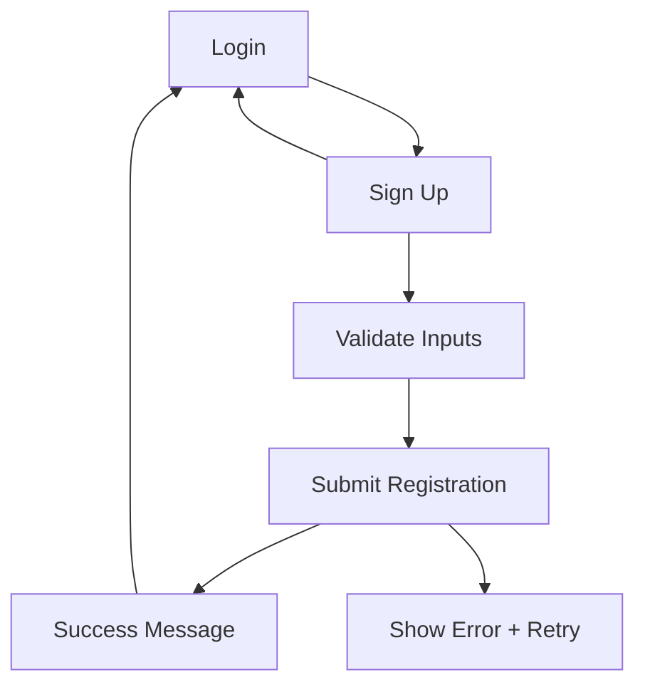

## 1. Product Overview
A desktop-first Sign Up page for the Waste Collection & Recycling Management System that matches the provided screenshot.
It enables new users to create an account with clear validation and a direct path back to Login.

## 2. Core Features

### 2.2 Feature Module
Our authentication requirements consist of the following main pages:
1. **Login**: split layout, sign-in form, Terms/Privacy links, link to Sign Up.
2. **Sign Up**: split layout matching screenshot, account creation form (username, email, phone + OTP, password + confirm), validation + feedback, link back to Login, footer links.

### 2.3 Page Details
| Page Name | Module Name | Feature description |
|---|---|---|
| Login | Sign Up entry | Navigate to **/auth/signup** via a clear “Sign up” link/button. |
| Sign Up | Layout shell | Render desktop-first split layout matching screenshot (left form panel + right visual panel). Collapse to single-column on smaller screens (visual panel hidden or moved below). |
| Sign Up | Header copy | Show title (“Create new account”) and short subtitle (“Join our community…”). |
| Sign Up | Username field | Capture username; validate required; show inline error. |
| Sign Up | Email field | Capture email address; validate required + basic email format; show inline error. |
| Sign Up | Password fields | Capture password and confirm password; validate required + minimum length; validate confirm matches password; allow show/hide password (optional but recommended for parity with Login). |
| Sign Up | Phone + OTP row | Capture phone number and OTP code as a single row on desktop; validate required inputs and basic formatting (digits/length). |
| Sign Up | Sign Up action | Submit form; disable inputs + show loading while pending; on success show success message and redirect to Login (or post-signup route if configured); on failure show a form-level error banner without losing entered values. |
| Sign Up | Secondary navigation | Provide “Already have an account? Log in” link back to **/auth/login**. |
| Sign Up | Footer links | Display “Privacy Policy”, “Terms of Service”, “Help Center” links (destinations can be placeholders until wired). |
| Sign Up | Accessibility | Ensure proper labels, keyboard-only flow, visible focus states, and `aria-describedby` for error text. |

## 3. Core Process
User Flow:
1. You open Login.
2. You choose “Sign up” to open Sign Up.
3. You enter username, email, password + confirm, phone, and OTP.
4. You submit Sign Up.
5. The page validates inputs and sends an account creation request.
6. On success, you see confirmation and are redirected (default: back to Login). On failure, you see an error and can retry.

