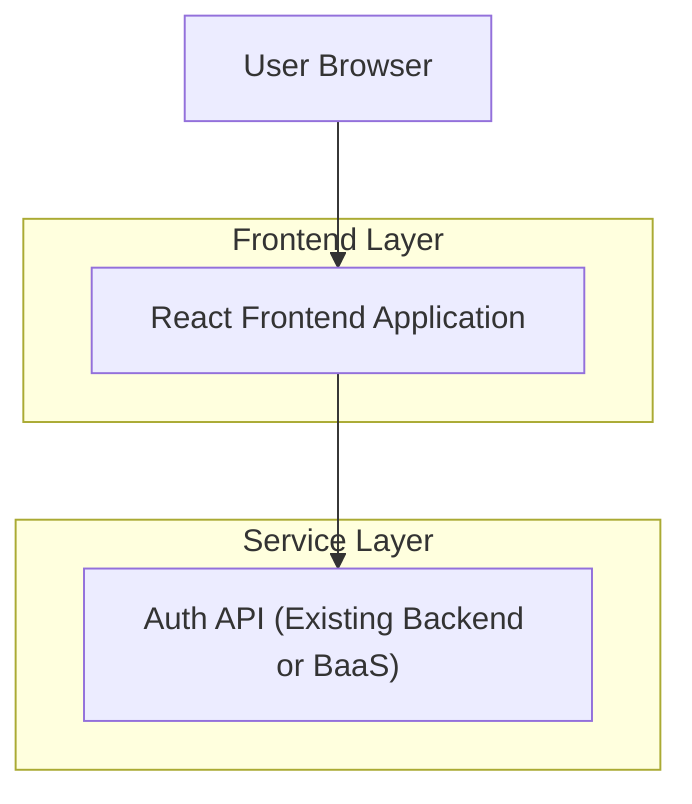

## 1.Architecture design


## 2.Technology Description
- Frontend: React@19 + tailwindcss@4 + vite + react-router-dom@6 + lucide-react
- Backend: None in this scope (auth UI calls a project-provided auth endpoint/service)

## 3.Route definitions
| Route | Purpose |
|-------|---------|
| /auth/login | Login page UI (split layout, form submission, error/loading states, link to Sign Up) |
| /auth/signup | Sign Up page UI (split layout matching screenshot, registration form + validation, link back to Login) |

## 4.API definitions (If it includes backend services)
Not included in this scope; the UI should call a project-provided auth layer (recommended to centralize API calls).

Suggested shared TypeScript-style types (even if implementation stays in .jsx):
```ts
type SignUpPayload = {
  username: string
  email: string
  password: string
  otp: string
}

type AuthResult =
  | { ok: true }
  | { ok: false; message: string }
```

Integration notes:
- Login: call something like `signIn({ email, password, rememberMe })`.
- Sign Up: call something like `signUp(payload)` (endpoint name is project-defined).
- Handle pending/success/error states consistently with existing `LoginCard.jsx` patterns.

## 6.Data model(if applicable)
Not applicable for UI-only scope.
